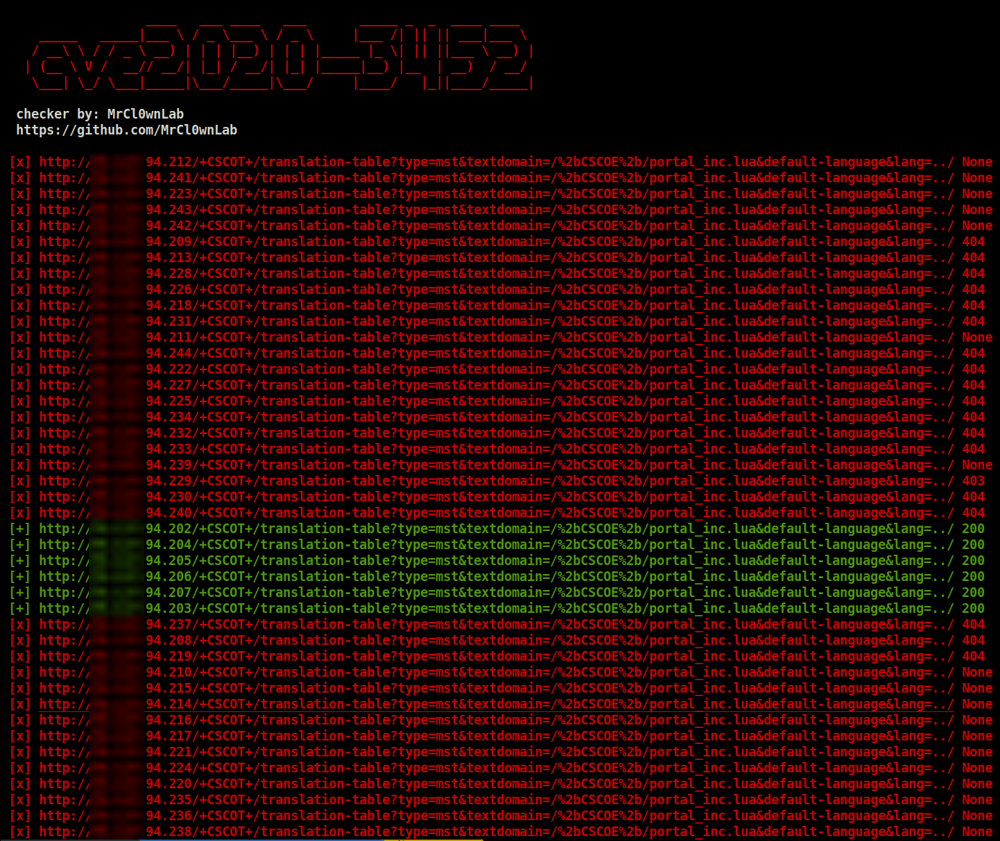

# Checker CVE-2020-3452
This Python script checks whether the target server is vulnerable to CVE-2020-3452. Cisco Adaptive Security Appliance and FTD Unauthorized Remote File Reading

[](https://www.python.org/)
[]()
[]()


A vulnerability in the web services interface of Cisco Adaptive Security Appliance (ASA) Software and Cisco Firepower Threat Defense (FTD) Software could allow an unauthenticated, remote attacker to conduct directory traversal attacks and read sensitive files on a targeted system. The vulnerability is due to a lack of proper input validation of URLs in HTTP requests processed by an affected device. An attacker could exploit this vulnerability by sending a crafted HTTP request containing directory traversal character sequences to an affected device. A successful exploit could allow the attacker to view arbitrary files within the web services file system on the targeted device. The web services file system is enabled when the affected device is configured with either WebVPN or AnyConnect features. This vulnerability cannot be used to obtain access to ASA or FTD system files or underlying operating system (OS) files. 

```
 + Autor Script: MrCl0wn
 + Blog: http://blog.mrcl0wn.com
 + GitHub: https://github.com/MrCl0wnLab
 + Twitter: https://twitter.com/MrCl0wnLab
 + Email: mrcl0wnlab\@\gmail.com
```

## Discovery CVE
Mikhail Klyuchnikov & Ahmed Aboul-Ela

## REF
- https://nvd.nist.gov/vuln/detail/CVE-2020-3452
- https://tools.cisco.com/security/center/content/CiscoSecurityAdvisory/cisco-sa-asaftd-ro-path-KJuQhB86
- https://raw.githubusercontent.com/RootUp/PersonalStuff/master/http-vuln-cve2020-3452.nse

## Warning
```
+------------------------------------------------------------------------------+
|  [!] Legal disclaimer: Usage of afdWordpress for attacking                   |
|  targets without prior mutual consent is illegal.                            |
|  It is the end user's responsibility to obey all applicable                  | 
|  local, state and federal laws.                                              |
|  Developers assume no liability and are not responsible for any misuse or    |
|  damage caused by this program                                               |
+------------------------------------------------------------------------------+
```

## Usage
```bash
                   ____   ___ ____   ___       _____ _  _  ____ ____  
     _____   _____|___ \ / _ \___ \ / _ \     |___ /| || || ___|___ \ 
    / __\ \ / / _ \ __) | | | |__) | | | |_____ |_ \| || ||___ \ __) |
   | (__ \ V /  __// __/| |_| / __/| |_| |_____|__) |__  | __)  / __/ 
    \___| \_/ \___|_____|\___/_____|\___/     |____/   |_||____/_____|
                                                                   

$ python3.8 cve2020-3452.py --target <ip>
$ python3.8 cve2020-3452.py --target 192.168.15.1

$ python3.8 cve2020-3452.py --range  <ip_start>,<ip_end>
$ python3.8 cve2020-3452.py --range  192.168.15.1,192.168.15.86

$ python3.8 cve2020-3452.py --thread <thread>
$ python3.8 cve2020-3452.py --range  192.168.15.1,192.168.15.86  --thread 50
```

## IP Scan / Range


## Output
```bash
output.log
error.log
```
